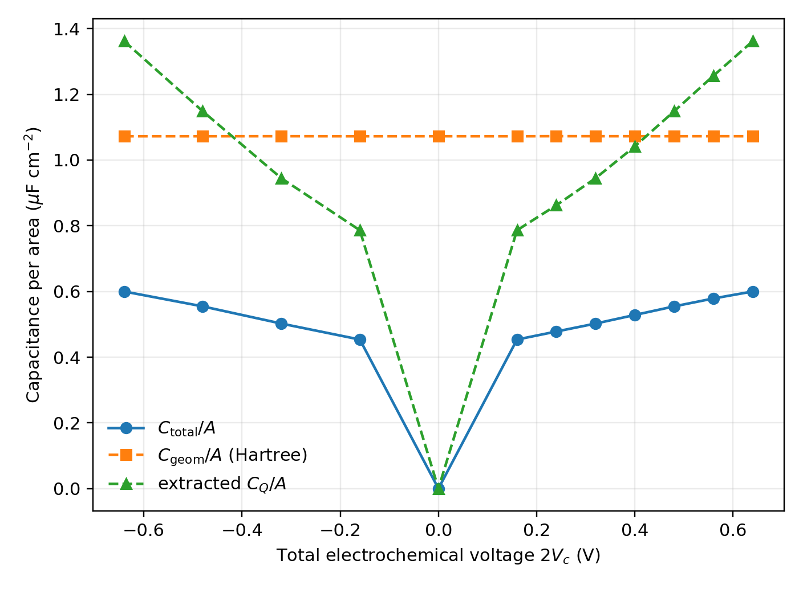
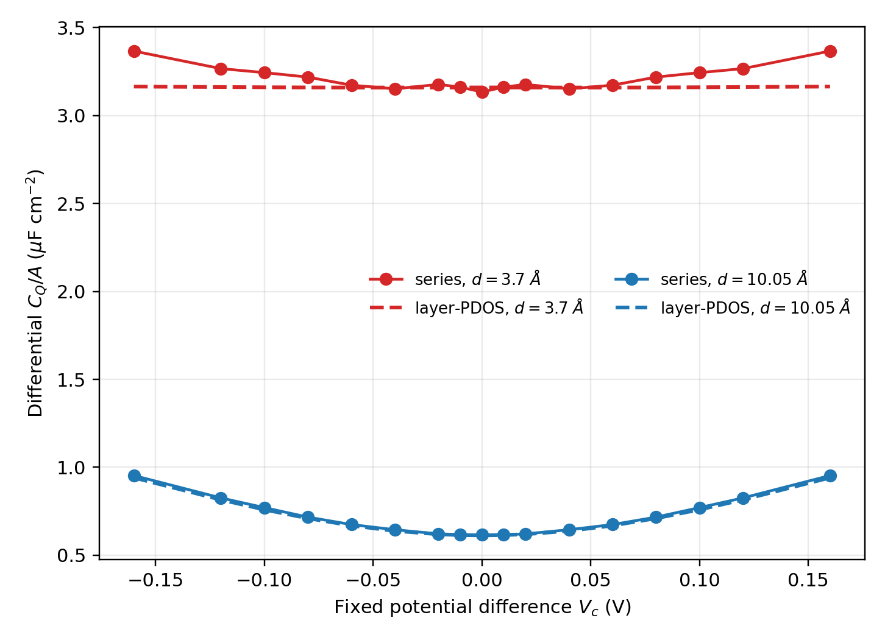
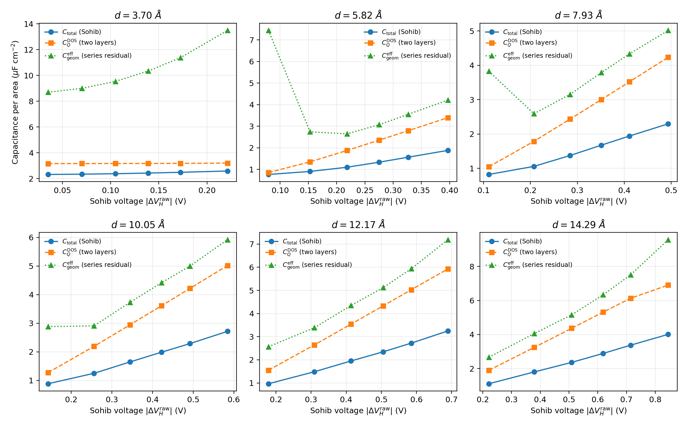
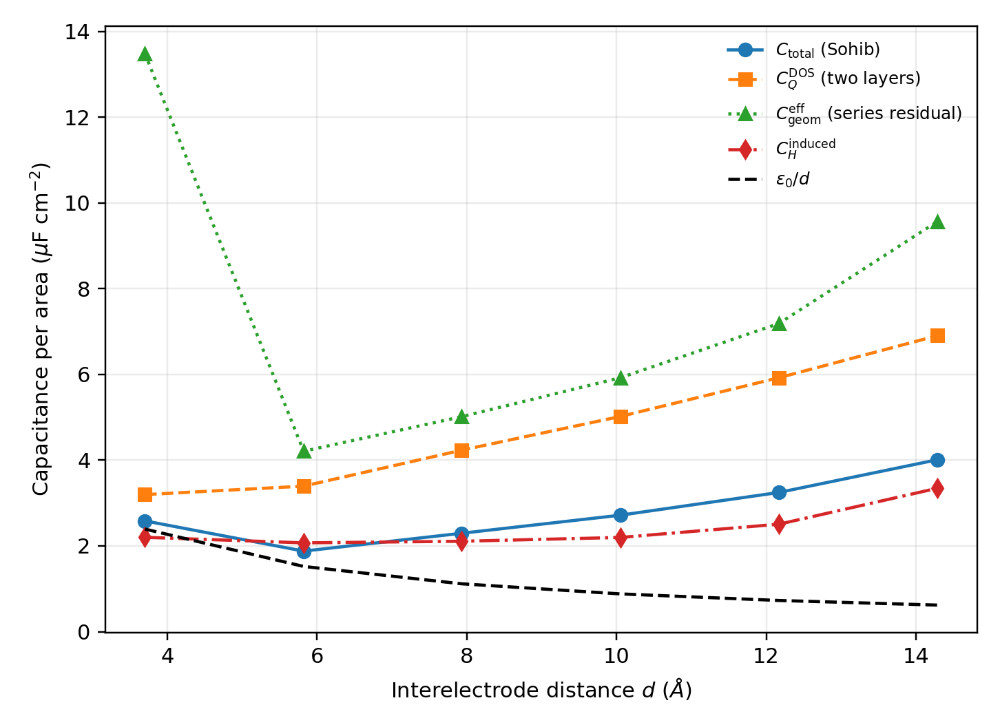
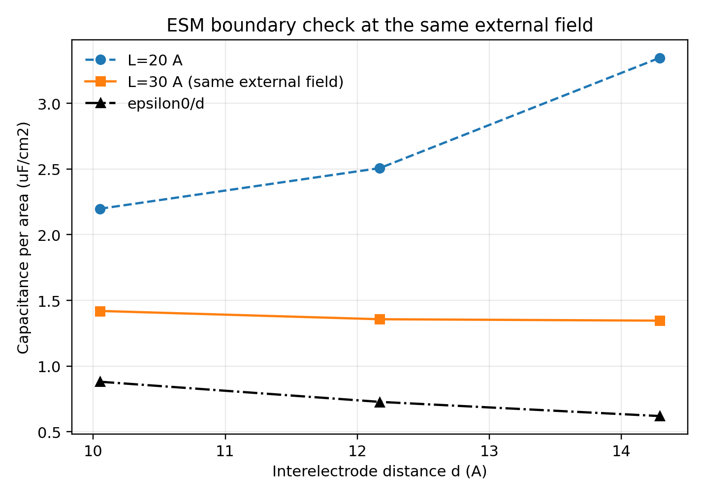
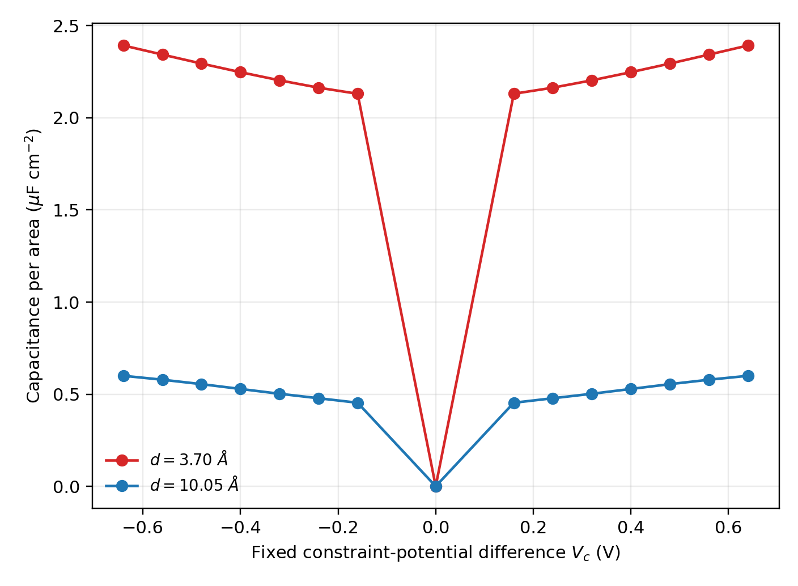
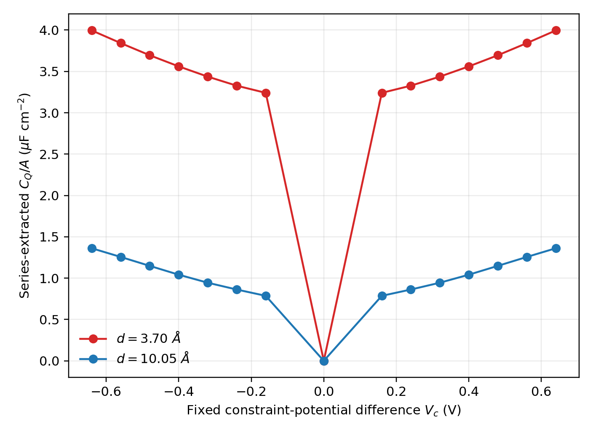
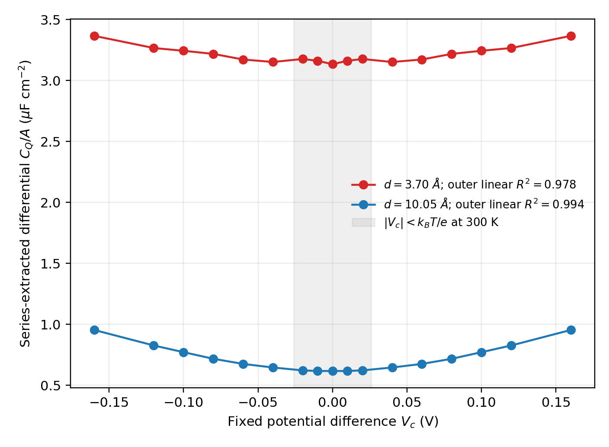
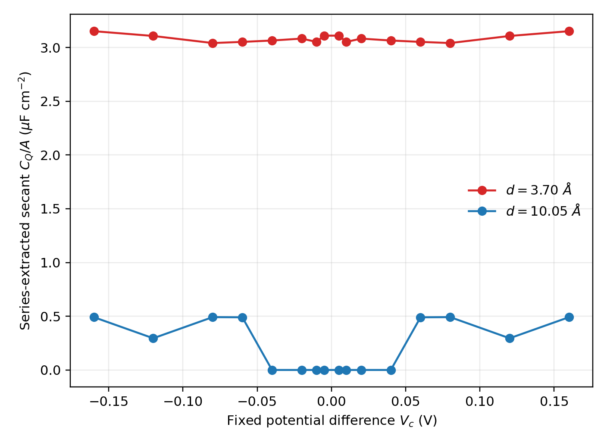

# Fixed Electrode Potential-Difference Extension for OpenMX 3.9.9

> **Development notice:** This code and its accompanying documentation were
> developed with assistance from OpenAI's `gpt-5.6-sol` model. The scientific
> design, validation choices, and responsibility for the resulting
> implementation remain with the project authors.

This tree contains a minimal two-electrode fixed-potential-difference
extension for OpenMX 3.9.9. It applies fixed local potentials to two atom
groups and determines the transferred charge self-consistently.

This repository distributes the implementation as a patch, not a copy of
OpenMX. Obtain OpenMX 3.9 and the official 3.9.9 bug-fix archive from the
OpenMX project, apply the official update first, and then apply the patch in
this repository.

## What is implemented

- Independent left/right electrode assignment without changing
  `Atoms.SpeciesAndCoordinates`.
- An automatically converged unconstrained reference state.
- Group-resolved Mulliken electron populations.
- A scalar constraint potential: `+Vc/2` on the left electrode and `-Vc/2`
  on the right electrode.
- The non-orthogonal-basis matrix element
  `0.5*(V_A+V_B)*S_AB`.
- A fixed input `Vc` equal to the full constraint-potential difference.
- Iteration and final-summary output.
- Hartree-potential plane averaging and capacitance analysis utilities.

The implementation is backward compatible when `Potential.ConstraintDFT` is
absent or set to `off`.

## Source files

The core changes are localized to:

- `source/openmx_common.h`
- `source/Input_std.c`
- `source/Set_Hamiltonian.c`
- `source/DFT.c`
- `source/makefile`
- `source/Potential_Constraint.c` (new)

Analysis programs:

- `source/capacitance_from_vhart.py`
- `source/paper_reproduction/plot_v_ct.py`
- `source/paper_reproduction/plot_capacitance_components.py`
- `source/paper_reproduction/plot_two_distance_cdft.py`
- `source/paper_reproduction/analyze_dirac_small_vc.py`

## Applying the minimal patch

Start from OpenMX 3.9 with the official 3.9.9 patch already applied, then run
from the OpenMX top-level directory:

```bash
patch -p1 < openmx-3.9.9-fixed-potential-difference.patch
cd source
# Configure CC, FC, and LIB in makefile for the local machine.
make openmx
```

The patch only adds `Potential_Constraint.o` to the makefile. Compiler and
library paths remain the responsibility of the local OpenMX installation.

## Fixed-potential-difference input

```text
Potential.ConstraintDFT        on
Potential.Constraint.Vc        0.24
Potential.Constraint.Output    on

<Potential.Constraint
1  1
2  1
3  2
4  2
Potential.Constraint>
```

Group meanings:

- `0`: unconstrained
- `1`: left electrode
- `2`: right electrode

A positive `Vc` applies `+Vc/2` to group 1 and `-Vc/2` to group 2. A negative
value reverses the polarity. `Vc` is in eV and numerically equals the full
constraint-potential difference in volts.

The transferred electron number is

```text
Q = 0.5*(-DeltaN_left + DeltaN_right).
```

The code first converges an ordinary `Vc=0` SCF calculation and stores its
left/right Mulliken populations. The constraint is activated only after that
reference has converged.

## Variational meaning of fixed Vc

Let the electrode weight be `w(r)=+1` on the left, `-1` on the right, and
zero elsewhere. For a prescribed, non-varied `Vc`, the electronic problem is
defined by

```text
F[n;Vc] = E_DFT[n] + (Vc/2) integral w(r)n(r)dr,
delta F/delta n(r) = 0.
```

Thus the added Kohn-Sham potential is `Vcon(r)=(Vc/2)*w(r)`. The SCF solution is
stationary with respect to the density for this fixed external potential.
It is not the usual target-charge cDFT saddle problem
`delta W/delta Vc=0`: this implementation never varies `Vc` and has no target
charge. Calling `Vc` a Lagrange multiplier is therefore inappropriate in the
fixed-only implementation; it is an externally specified conjugate field.

With `Q=0.5*(-DeltaNleft+DeltaNright)` and conserved total electron number,
`Nleft-Nright = constant-2Q`. Apart from a constant, the fixed-field term is

```text
Econ(Q) = -Vc*Q.
```

Minimization over `Q` consequently gives

```text
dE_DFT(Q)/dQ = Vc.
```

This is why the input `Vc` is the energy derivative conjugate to charge transfer and
is used as the constraint-potential voltage in the present Q-V curves. It is
not the self-consistent Hartree drop. The latter is obtained independently
from the plane-averaged Hartree cube.

In a non-orthogonal atomic-orbital basis, a local atom value cannot simply be
added to diagonal matrix elements. The implemented symmetric approximation is

```text
Hcon[A mu,B nu] = 0.5*(VA+VB)*S[A mu,B nu],
VA = +Vc/2 (left), -Vc/2 (right), or 0 (outside).
```

It is Hermitian and is the derivative of the corresponding approximate
one-body term `Tr[P Hcon]` with respect to the density matrix. Therefore the
modified Kohn-Sham eigenproblem is internally variational at fixed nuclei.
However, the current patch does not add this external-potential term and its
position derivative consistently to OpenMX's reported total energy, forces,
or stress. The converged density, transferred charge, and potentials are the
supported observables; constrained total-energy comparisons and structural
optimization are not variationally supported.

## Voltage sweep

For a V-C curve, run independent calculations with different values of:

```text
Potential.ConstraintDFT        on
Potential.Constraint.Vc        0.24
```

`Vc` is always fixed; there is no charge-target feedback mode. The electronic
SCF determines `Q` self-consistently.
Sweep `Vc` over separate calculations, collect the resulting charge
and Hartree-potential difference, and construct the Q-V and V-C curves.

`Vc` is a fixed external conjugate field and must not automatically be
identified with the Hartree voltage. Its relation to the experimentally
relevant electrochemical voltage depends on the thermodynamic definition
used in the analysis.

## ESM boundary condition

For an isolated capacitor along the ESM direction, the calculations in
`source/paper_reproduction` use:

```text
ESM.switch      on1
ESM.direction   x
```

This applies the vacuum-cell-vacuum boundary condition in the non-periodic
direction and removes the corresponding periodic-image electrostatic
interaction. The in-plane directions remain periodic.

## Hartree-potential sign

OpenMX `dVHart` is an electron potential energy in the one-electron
Hamiltonian. The physical electrostatic voltage has the opposite sign:

```text
phi = -V_H/e.
```

The analysis utility reports both `Delta(V_H/e)` and `Delta phi` explicitly.
A sign correction changes voltage polarity but does not change the positive
capacitance magnitude `|Q e / Delta phi|`.

## d = 10.05 A graphene result

The fixed-`Vc`, ESM-on1 sweep was performed for both potential polarities.
The negative calculations exchange the roles of the two graphene sheets and
reproduce the positive branch to the printed numerical precision:

| `Vc` full difference (V) | Q (electron/cell) | Cgeom/A (uF/cm2) | Ctotal/A (uF/cm2) | extracted CQ/A (uF/cm2) |
|---:|---:|---:|---:|---:|
| -0.64 | -0.00126618 | 1.07236 | 0.59993 | 1.36177 |
| -0.48 | -0.00087786 | 1.07237 | 0.55459 | 1.14860 |
| -0.32 | -0.00053004 | 1.07249 | 0.50228 | 0.94472 |
| -0.16 | -0.00023935 | 1.07231 | 0.45363 | 0.78624 |
| +0.16 | +0.00023935 | 1.07231 | 0.45363 | 0.78624 |
| +0.32 | +0.00053004 | 1.07249 | 0.50228 | 0.94472 |
| +0.48 | +0.00087786 | 1.07237 | 0.55459 | 1.14860 |
| +0.64 | +0.00126618 | 1.07237 | 0.59993 | 1.36176 |



The Hartree-only capacitance

```text
Cgeom = |Q| e / |Delta phi_H|
```

is constant because the Poisson response is linear at fixed geometry. The
constraint term is `(Vc/2)*(Nleft-Nright) = -Vc*Q + constant`, so stationarity
gives `dE_DFT/dQ = Vc`. We therefore use the input full difference and define

```text
Ctotal = |Q| e / |Vc|.
```

This produces the symmetric V-shaped total-capacitance curve. An effective
quantum/electronic capacitance is extracted from the series relation

```text
1/Ctotal = 1/Cgeom + 1/CQ.
```

`CQ` here includes non-Hartree electronic contributions represented by the
fixed-potential energy response; it is not a direct density-of-states calculation.

For a DOS-based comparison, the two electrodes must be treated separately.
For layer-projected DOS per cell `D_L(E)` and `D_R(E)` in states/eV,

```text
CQ_L/A = (e/A) integral D_L(E) [-df(E-mu_L,T)/dE] dE,
CQ_R/A = (e/A) integral D_R(E) [-df(E-mu_R,T)/dE] dE,
1/CQ_DOS_transfer = 1/CQ_L + 1/CQ_R,
CQ_DOS_transfer = CQ_L CQ_R/(CQ_L + CQ_R).
```

The prefactor is `e/A` for energies and DOS in eV. The equivalent SI formula
using joules has the usual `e^2/A` prefactor. For equivalent layers at zero
bias, `CQ_L=CQ_R=CQ_layer`, so `CQ_DOS_transfer=CQ_layer/2`. If
`D_bilayer=2 D_layer`, this becomes

```text
CQ_DOS_transfer/A = (e/4A) integral D_bilayer(E) [-df(E-mu,T)/dE] dE.
```

Using the total bilayer DOS directly as if it were one electrode would
overestimate the charge-transfer capacitance by a factor of four. At short
distance, hybridization makes the layer DOS projection-dependent.

The comparison was evaluated at 300 K from zero-bias OpenMX layer PDOSs on a
`1x300x300` k grid, with 0.005 eV Gaussian broadening. At each fixed-`Vc`
point the non-Hartree voltage is `VQ=Vc-Delta_phi_H`; the symmetric rigid-band
mapping `mu_L=+VQ/2`, `mu_R=-VQ/2` is used before combining the two layer
capacitances in series.



| d (A) | Vc (V) | series differential CQ/A | layer-DOS transfer CQ/A |
|---:|---:|---:|---:|
| 3.70 | 0.00 | 3.134 | 3.159 |
| 3.70 | 0.16 | 3.366 | 3.164 |
| 10.05 | 0.00 | 0.616 | 0.613 |
| 10.05 | 0.16 | 0.953 | 0.941 |

Capacitances are in `uF/cm2`. The agreement at 10.05 A includes both the
thermally rounded Dirac minimum and its rise with voltage. At 3.70 A both
methods give a finite, nearly flat response near `3.1 uF/cm2`, supporting the
interpretation that interlayer hybridization removes the isolated-monolayer
zero-DOS response. The remaining difference at finite voltage reflects the
zero-bias rigid-band approximation, self-consistent band changes, and the
projection dependence of strongly hybridized layers.

The plotted data, layer PDOSs, and analysis script are
`graphene_cq_dos_vs_series_300k.csv`, `dos300_d*.PDOS.Gaussian.atom*`, and
`analyze_dos_vs_series_cq_300k.py` in `source/paper_reproduction`.
The origin shown in the plot uses the paper-style convention
`Ctotal(0)=0`. A rigorous zero-bias differential capacitance instead requires
additional points closer to zero and the derivative `dQ/dV`.

## Comparison with the published result and experiment

For `d=10.05 A` and a voltage magnitude near `0.6 V`, the three relevant
results are:

| calculation/definition | C/A (uF/cm2) | Q (electron/cell) |
|---|---:|---:|
| value quoted in Sohib et al. | approximately 2.25 | approximately 0.00445 (inferred) |
| ESM-on4 reproduction at 0.584 V | 2.7166 | 0.005233962 |
| present ESM-on1 fixed-`Vc` result near 0.6 V | approximately 0.59 | approximately 0.00117 |
| Hartree-only geometric result in the fixed-`Vc` sweep | approximately 1.0724 | approximately 0.00117 |

The fixed-`Vc` value is therefore of the same order of magnitude as the
published value, and it reproduces the symmetric V-shaped trend, but it is
only about 26% of the quoted value. It should not be described as quantitative
agreement. The ESM-on4 reproduction is much closer to the published number.

The main reason is that these calculations impose different boundary
conditions and do not use interchangeable voltage definitions. ESM on4 with
`ESM.potential.diff` applies an external field across the cell. ESM on1 plus
the local fixed `+Vc/2,-Vc/2` potential instead drives charge transfer directly while
removing the nonperiodic image interaction. Moreover, `Vc` is the variable
conjugate to transferred charge in the fixed-potential functional; it is not the Hartree
potential difference and must not be added to it. Differences in stacking,
ESM boundary positions, the authors' unreleased ESM modifications, charge
partitioning, and whether a secant or differential capacitance is reported
can produce additional discrepancies. Carbon SOC is unlikely to explain the
factor-of-four charge difference.

Which result corresponds to experiment depends on the measurement. The
Hartree-only quantity is a geometric/electrostatic capacitance. A two-terminal
capacitance measurement responds to the electrochemical voltage and generally
contains geometric and quantum contributions in series,

```text
1/Cmeas = 1/Cgeom + 1/CQ.
```

Thus the constrained calculation is conceptually closer to an image-free
two-terminal capacitor, whereas ESM on4 is the appropriate comparison for the
paper's externally driven protocol. A direct small-signal experimental
comparison should use the differential quantity `dQ/d(Vc)`, not the finite
bias secant `Q/(Vc)`, and should test the dependence on the Mulliken group
definition. Consequently neither the present `Ctotal` nor the paper's
Hartree-based ratio should be identified with an experimental terminal
capacitance without these qualifications.

## Stock-OpenMX reanalysis of the Sohib protocol

A new stock OpenMX 3.9.9 ESM-`on4` sweep was performed at 300 K for six
interelectrode distances, `d = 3.70, 5.82, 7.93, 10.05, 12.17, 14.29 A`, and
`ESM.potential.diff = 0.4, 0.8, 1.2, 1.6, 2.0, 2.6 V`, using the paper's
`1x100x100` SCF k grid. Following Sohib et al., the operational total
capacitance uses the raw layer-to-layer `.vhart` difference,

```text
Ctotal_Sohib/A = |Q| e/(A |Delta V_H_raw|).
```

The two-electrode DOS capacitance is evaluated at 300 K from layer-projected
DOSs and combined in series,

```text
CQ_i_DOS/A = (e/A) integral D_i(E) [-df(E-mu_i,T)/dE] dE,
mu_L = +Delta V_H_raw/2,  mu_R = -Delta V_H_raw/2,
1/CQ_DOS_transfer = 1/CQ_L_DOS + 1/CQ_R_DOS.
```

An effective residual geometric capacitance can then be defined algebraically:

```text
1/Cgeom_effective = 1/Ctotal_Sohib - 1/CQ_DOS_transfer.
```



At the largest field the results are:

| d (A) | raw Hartree voltage (V) | Q (electron/cell) | Ctotal_Sohib/A | CQ_DOS_transfer/A | Cgeom_effective/A |
|---:|---:|---:|---:|---:|---:|
| 3.70 | 0.22123 | 0.00188552 | 2.584 | 3.197 | 13.484 |
| 5.82 | 0.39674 | 0.00245849 | 1.879 | 3.395 | 4.209 |
| 7.93 | 0.49365 | 0.00373626 | 2.295 | 4.232 | 5.014 |
| 10.05 | 0.58424 | 0.00523396 | 2.717 | 5.019 | 5.922 |
| 12.17 | 0.68925 | 0.00738125 | 3.247 | 5.923 | 7.188 |
| 14.29 | 0.84493 | 0.01117732 | 4.011 | 6.906 | 9.571 |

Capacitances are in `uF/cm2`. These `Cgeom_effective` values are series
residuals, not classical vacuum geometric capacitances. In stock OpenMX
`on4`, the imposed ESM ramp is inserted into `dVHart_Grid_B`, and therefore
is included in `.vhart`. Subtracting the analytic external ramp before taking
the layer difference is also reported as an induced-Hartree diagnostic. At
The signed ramp is `Delta V_ext(R-L) = -V_ESM*d/L`, directly from the
`-0.5*V_ESM*(z-z1)/z1` term in `Poisson_ESM.c`. At 2.6 V the corrected
diagnostic gives 2.201, 2.072, 2.109, 2.197, 2.507, and 3.347 `uF/cm2`, whereas
`epsilon0/d` gives 2.393, 1.521, 1.116, 0.881, 0.728, and 0.620 `uF/cm2`.



The induced-Hartree diagnostic is not a clean geometric capacitance over the
whole series. At short distance, orbital overlap and Mulliken partitioning
matter. At `d=14.29 A`, each sheet is only 2.855 A from its ESM boundary in
the 20 A cell, below the approximately 3 A practical clearance quoted in the
paper, so boundary/contact effects contaminate the endpoint. The agreement
with `epsilon0/d` near `d=10.05 A` is therefore not a validation of this
subtraction over the full range.

### ESM-boundary convergence check

The three largest separations were repeated in a 30 A cell. Merely keeping
`ESM.potential.diff` fixed would reduce the external field when the cell is
enlarged, so the 30 A voltages were multiplied by `30/20 = 1.5`. Thus the
20 A result at 2.6 V is compared with the 30 A result at 3.9 V, keeping both
the external field and `V_ESM*d/L` fixed.

| d (A) | edge clearance, L=20 A | edge clearance, L=30 A | CH induced, L=20 A | CH induced, L=30 A | epsilon0/d |
|---:|---:|---:|---:|---:|---:|
| 10.05 | 4.975 | 9.975 | 2.197 | 1.420 | 0.881 |
| 12.17 | 3.915 | 8.915 | 2.507 | 1.357 | 0.728 |
| 14.29 | 2.855 | 7.855 | 3.347 | 1.346 | 0.620 |



Capacitances are in `uF/cm2` and clearances are in A. Increasing the clearance
reduces the 14.29 A result from 3.347 to 1.346, confirming strong ESM-boundary
contamination in the 20 A cell. The nearly flat 30 A trend remains about
1.5--2.2 times `epsilon0/d`, so this Hartree diagnostic is not the ideal
geometric capacitance.

Thus the paper-style decomposition is mathematically reproducible, but its
large residual should be called `effective other/series capacitance`, not a
pure geometric capacitance. The CSV, plot script, and stock-OpenMX inputs are
in `source/paper_reproduction` and `examples/sohib_on4_stock`.

## Two-distance analogues of Fig. 4(b) and 4(c)

The same ESM-on1 fixed-`Vc` sweep was run at `d=3.70 A` and `10.05 A`.
At `|Vc|=0.6 V` (linear interpolation), the results are:

| d (A) | Q (electron/cell) | Ctotal/A | Cgeom/A | series-extracted CQ/A |
|---:|---:|---:|---:|---:|
| 3.70 | 0.00469 | 2.37 | 5.98 | 3.92 |
| 10.05 | 0.00117 | 0.589 | 1.072 | 1.31 |

Capacitances are in `uF/cm2`. The paper reports approximately 3.4 and 2.25,
respectively, at 0.6 V. The present implementation therefore gives about 70%
and 26% of the paper values. The short-distance Hartree geometric result
decreases mildly from 6.22 to 5.96 `uF/cm2` over the sweep, consistent with
interlayer density overlap; the 10.05 A result stays near 1.0724.





The two panels are intentionally separate, following the paper: the first
contains only `Ctotal`, and the second only the series-extracted effective
`CQ`. Both use the A/B-symmetric negative branch and the paper-style zero to
display the V shape. The Hartree-only result is kept in a separate diagnostic
plot: `source/paper_reproduction/graphene_two_distance_cgeom.png`.

The extracted effective `CQ` does form a V-like curve resembling Fig. 4(c),
but the quantities are not identical. The paper obtains `CQ` by thermally
broadening the high-resolution graphene DOS. Here it is the residual response
defined by the series equation, so it includes fixed-potential non-Hartree response and,
especially at 3.70 A, interlayer hybridization and charge-partition effects.
Its strong distance dependence demonstrates this distinction. The plotted
zero is a paper-style convention; calculations begin at `|Vc|=0.16 V`, so
the zero-bias value and differential slope have not been determined.

The numerical data and plotting code are
`source/paper_reproduction/graphene_two_distance_cdft.csv` and
`source/paper_reproduction/plot_two_distance_cdft.py`.

## Small-Vc Dirac-band validation

The apparent zero in the earlier secant-capacitance plot was a display
convention, not a calculated point. To resolve the Dirac region, new ESM-on1
calculations were performed at

```text
Vc = 0.01, 0.02, 0.04, 0.06, 0.08, 0.10, 0.12, 0.16 V
```

for both distances, using a multiple-of-three `1x300x300` k grid chosen to
resolve the K region, 300 K electronic temperature, and an SCF criterion of `1e-8`
Hartree. Odd symmetry supplies the negative branch. Differential, rather than
secant, capacitances were evaluated from the symmetric data:

```text
Ctotal_diff/A = (e/A) dQ/dVc
CH_diff/A     = (e/A) dQ/d(Delta phi_H)
1/CQ_diff     = 1/Ctotal_diff - 1/CH_diff.
```



The result provides a direct qualitative Dirac-band diagnostic:

| d (A) | CQ_diff(0)/A | CQ_diff(0.16 V)/A | linear-fit R2, 0.06--0.16 V |
|---:|---:|---:|---:|
| 3.70 | 3.134 | 3.366 | 0.978 |
| 10.05 | 0.616 | 0.953 | 0.994 |

Capacitances are in `uF/cm2`. At 10.05 A, `CQ_diff` has a finite rounded
minimum inside the 300 K thermal scale `kBT/e = 0.026 V`, followed by an
almost linear increase with `|Vc|`. This is the expected thermally broadened
signature of a graphene Dirac DOS. At 3.70 A the response is much larger and
nearly flat; interlayer density overlap and band hybridization suppress the
isolated-Dirac signature. Thus the series-extracted response does detect the
Dirac-band character in the weakly coupled 10.05 A system, while also
distinguishing its loss at short separation. It remains an effective
non-Hartree capacitance, not an independent DOS integration.

The complete differential data and analysis are in
`graphene_dirac_small_vc_differential.csv` and
`analyze_dirac_small_vc.py` in `source/paper_reproduction`.

## Zero-temperature series extraction

The sweep was repeated at an electronic temperature of exactly `0 K`, with
ESM `on1`, the same `1x300x300` k grid and `1e-8` Hartree SCF criterion, at

```text
Vc = 0.005, 0.01, 0.02, 0.04, 0.06, 0.08, 0.12, 0.16 V.
```

No DOS formula is used in this analysis.  At every nonzero-voltage point the
secant capacitances are obtained from the calculated transferred charge and
Hartree potential difference,

```text
Ctotal/A = |Q| e / (A |Vc|),
CH/A     = |Q| e / (A |Delta phi_H|),
1/CQ     = 1/Ctotal - 1/CH,
```

or, equivalently,

```text
CQ/A = |Q| e / {A (|Vc| - |Delta phi_H|)}.
```

Here `CH` is the effective Hartree electrostatic capacitance and `CQ` is the
effective non-Hartree residual.  These are secant quantities; they should not
be confused with the differential capacitances in the preceding section.



For `d=3.70 A`, the result is nearly voltage independent,
`CQ/A = 3.04--3.15 uF/cm2`, consistent with strong interlayer overlap and
hybridization.  For `d=10.05 A`, the 300x300 mesh gives the following exact
zero-temperature occupation sequence:

| Vc (V) | Q (electron/cell) | series CQ/A (uF/cm2) |
|---:|---:|---:|
| 0.005--0.04 | 0 | 0 |
| 0.06 | 0.00008889 | 0.490 |
| 0.08 | 0.00008889 | 0.492 |
| 0.12 | 0.00008889 | 0.295 |
| 0.16 | 0.00017778 | 0.491 |

The steps are finite-k sampling effects, not evidence for a physical band
gap.  At exactly zero temperature a finite mesh changes occupations only when
a discrete sampled state crosses the Fermi level.  Consequently the smooth
Dirac-limit relation `CQ -> 0` as `Vc -> 0` is represented here by zero charge
below the first crossing, followed by a staircase.  A smooth T=0 V-shaped
differential curve requires systematic k-grid convergence toward the
continuum limit; numerical differentiation of this finite-mesh staircase
would not be meaningful.

The complete table and reproducible series-only analysis are
`graphene_dirac_t0_series.csv` and `analyze_dirac_t0_series.py` in
`source/paper_reproduction`.

Example:

```bash
python3 source/capacitance_from_vhart.py result.vhart.cube \
  --axis 1 --left 0.24875 --right 0.75125 --log result.std
```

## Documentation

- Japanese note: `fixed_potential_difference_implementation_note.tex` and `.pdf`
- English note: `fixed_potential_difference_implementation_note_en.tex` and `.pdf`

The `examples/d3.70`, `examples/d10.05`, and `examples/dirac_small_vc`
directories contain fixed-`Vc` inputs. Filenames use the full input
difference. Set `DATA.PATH` for the local OpenMX installation before running
them. Large OpenMX outputs, restart files, Hartree cubes, the OpenMX
distribution, and the article PDF are intentionally not included.

## Important limitations

- Constraint-energy and constraint-force terms are not implemented.
  Constrained geometry optimization and total-energy comparisons are not yet
  supported.
- The reference populations and `Vc` are not persisted in restart files.
- Mulliken populations depend on the basis set.
- NEGF is explicitly rejected by this MVP.
- Multiple independent constraints are not implemented.

## License

OpenMX is distributed under the GNU General Public License. This extension is
intended to be distributed under the same terms when shared as modifications
to OpenMX.
